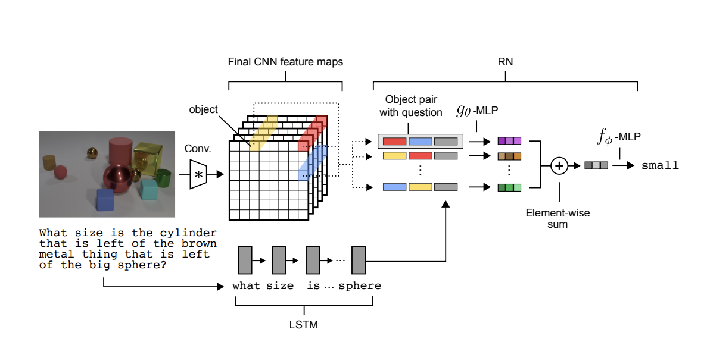

# Sort-of-CLEVR
Code adapted from kimhc6028's [repo](https://github.com/kimhc6028/relational-networks). All rights reserved to their respective owners. 

Pytorch implementation of [A simple neural network module for relational reasoning](https://arxiv.org/pdf/1706.01427.pdf)

In this repo, Relational Networks are tested on the Sort-of-CLEVR dataset using a CNN augmented with RN along with state descriptions.

## **What are Relational Networks?**

Relational networks are, in essence, a module made for neural networks that contain a structure designed for reasoning the relations between objects. Similar to how other neural network architectures such as CNNs are able deduce spatial features without explictly learning it or how RNNs are able to establish dependencies on sequential inputs, the ability to ground relationships is built into Relational networks. 

Although Relational networks can be used on their own, they are also modules that can be used in existing network architectures. This means that Relational networks can be "plugged in" to existing networks such as CNNs or LSTMs by taking in as input the object embeddings of such networks in order to solve problems that inherently rely on relational reasoning.  

## **How do Relational Networks Work**

 In simple terms, RNs can be represented in the form:

$RN(O) = f_{\phi}(\Sigma_{i,j}g_{\theta}(o_i,o_j))$

In this equation, O = $\{o_1, o_2, o_3, ..., o_n\}$ are sets objects to be inferred upon, $f_{\phi}$ and $g_{\theta}$ are functions parameterized by the learnable parameters $\phi$ and $\theta$. In this equation, $g_{\theta}$ is the function used to make inferences about the relationship (if there is any at all) between objects. In other words, it would be calculating the "relation" between objects.  $\Sigma_{i,j}g_{\theta}(o_i,o_j)$ hence would essentially be taking the sum of all relational calculations between all possible pairs of objects. For this repo, both $g_{\theta}$ and $f_{\phi}$ are MLPs with learnable weights. By considering all possible pairs of objects, a detailed understanding about how all objects are related to each other can be made. 

## **Conditioning on Question**

For the purposes of a QA architecture, simply having $g_{\theta}(o_i,o_j)$ would be meaningless in trying to reason about object relationships as the relationships between objects should be dependent on what type of question we ask. Relationships that detail the similarily in color between two objects would be irrelevant for questions that ask about spatial positioning. For this reason, the RN can be augmented to be $a = f_{\phi}(\Sigma_{i,j}g_{\theta}(o_i,o_j, q))$. This way, the question is taken into consideration for the processing of $g_{\theta}$. This question embedding is also flexible, as it could be hard encoded as a binary string, or as embeddings from a LSTM. As we pass the question embedding into the RN directly with the objects, we are able to condition the relations that the RN generates on the questions we pass in. 

## **Example Relational Network**

In defining RNs, we said that RNs take objects as inputs. There is flexibility in the definition for what can taken as an "object". For example, RNs are able to take inputs such as CNN outputs as shown in the example architecture below designed for answering questions about objects in a scene. This architecture also showcases the conditioning on question as described in the section above, as it takes the LSTM embedding of a question as part of the input for $g_{\theta}$ along with the object pairings. 

In this example a CNN is used to convert pixels as input into objects that can be used in the RN. These pixels are derived from an input image of 128x128 dimension that is convolved through four convolutional layers. The resulting cells are used as the the "objects" for the RN to calculate relations. In the same vein, questions are processed through a LSTM network, with the resulting embedding being the question to which the RN is conditioned on. 

This is a very general example for how RNs work. As stated before, there is flexibility in what can be considered an "object", and since RNs are invariant to the order of objects as the input due to the summation term, we have flexibility in how we pass objects into the RN as well. These properties will be seen in how RNs deal with state descriptions. Generally, all the RN requires are object pairings (as a result from some network like a CNN or from a matrix that's directly passed in such as state descriptions) that are optionally combined with some question embedding as the input (for conditioning) to the start of the RN. This input is passed into $g_{\theta}$ (MLP) which calculates the relationships between objects. The result of $g_{\theta}$ is summed element-wise and finally passed into $f_{\phi}$ (MLP). 

## **Sort-of-CLEVR Dataset**

In Sort-of-CLEVR, we are dealing with a dataset composed of 10000 images and 20 questions (10 relational questions and 10 non-relational questions) for each image. Each image has a total of 6 objects, with each object being a either asquare or circle. Each object has a differnet color so that all six objects can be distinguished. The question is also hard-coded into a fixed-length binary sequence, eliminating the difficulties of natural language processing. The task is for our model to learn to answer questions about the image which involes a very high level of scene understanding. The aforementioned factors combined make Sort-of-CLEVR a great dataset to showcases the power RNs have learning general relational reasoning.

Above is a sample image in the Sort-of-CLEVR dataset. 

## **Tasks**
For this repo, we will be testing the power of RNs against the Sort-of-CLEVR dataset by doing two tasks: 
1. Sort-of-CLEVR from pixels
2. Sort-of-CLEVR from state descriptions

In Sort-of-CLEVR from pixels we will test the power of RNs using the regular dataset as described in the section above. We will be using a CNN augmented with RN to perform this task. 

In Sort-of-CLEVR from state descriptions, instead of using images as the inputs for our network, we will be using a state description matrix. Each row in the state description matrix will represent an object in the image, and each column will be a feature describing the object such as location or color. Below is an example table containing one object:
| (x,y)       | Color       | Shape         |  Size         | 
| :---:       |    :----:   |    :----:     |    :----:     |
|   (32,15)   |(0,255,0)    |      Circle   |       5       |

## **Dealing with Pixels**
To process images, we used a CNN with 4 convolutional layers of 32, 64, 128, and 256 kernels. ReLU was used for non-linearities and batch normalization is done after each convolution. The embeddings from the CNN are passed into the RN along with the questions embeddings that are encoded as fixed-length binary strings. To train, each object from the CNN is paired with with another object, along with a question. Thus, the resulting row would be object $o_{i}$, object $o_{j}$, and a question embedding.
This is passed into $g_{\theta}$, which we defined as a 4-layer MLP consisting of 2000 units each. ReLU non-linearities were used at each layer. Lastly, defined $f_{\phi}$ as a 4-layer MLP consisting of 1000, 500, 100, and 10 units with ReLU non-linearities. A final softmax layer is applied for answers. The model was trained using a mini-batch size of 64. 

## **Dealing with State Description**
As we are not dealing with images in state descriptions, we no longer need any of the visual processing that was needed for Sort-of-CLEVR from pixels. Thus, we can scrap the CNN input. This is also due the fact that state descriptions are, in essence, like object representation, which means we can directly plug them into the RN. We also have to make the objects in the matrix an input acceptable by the network. To do this, we create a new matrix with each column being an value represenation of the original feature. The resulting matrix have 2 features corresponding to x and y coordinates, 3 features for RGB values, 1 feature describing shape (binary in this case), and 1 feature describing size. The resulting matrix is of shape (6,7), and describes the state of the image just as an image would. This matrix is passed into the RN and the same process of pairing objects with other objects (36 possible pairings in this case) along with a question embedding is done. For this task, we used a 4-layer MLP of 512 units each for $g_{\theta}$ with ReLU non-linearities. For $f_{\phi}$, we used a 3-layer MLP of 512, 1024 (with 2% dropout), and 10 units with ReLU non linearities. A final softmax layer is applied for answers. The model was trained using a mini-batch size of 64. 
## **How to Run*** 
To generate Sort-of-CLEVR dataset & state descriptions

	$ python sort_of_clevr_generator.py 

To train binary CNN_RN model

	$ python main.py 

To train binary state description model

	$ python main.py --model RN_state_desc --dataset state_desc

To resume pretrained CNN_RN model

    $ python main.py --model CNN_RN_SOC --resume epoch_22_CNN_RN_SOC.pth

To resume pretrained state description model

    $ python main.py --model RN_state_desc --resume epoch_80_RN_statedesc.pth --dataset state_desc

## **Performance**
| | CNN + RN (22th epoch) | State Descriptions (80th epoch) |
| --- | --- | --- |
| Non-relational question | 99% | 99.6% |
| Relational question | 90% | 96% |

